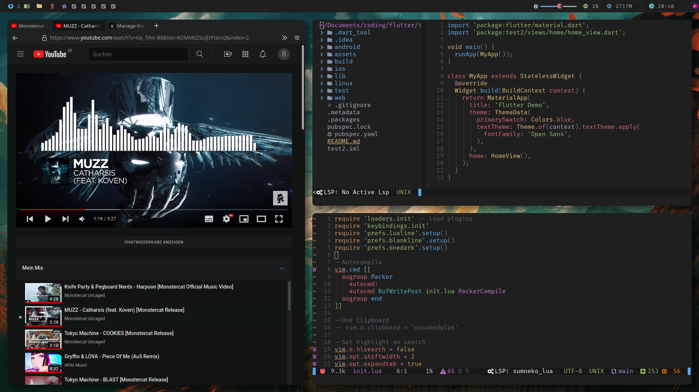

# Dotfiles

This repository holds my Arch Linux dotfiles.



## Dependencies

Stow is required to apply them automatically.

Other requirements:

- Picom with rounded corners (https://aur.archlinux.org/packages/picom-ibhagwan-git/)
- Bspwm and Sxhkd
- Neovim
- Ranger
- Kitty
- Feh
- Rofi
- Polybar
- Zshell
- Zplug
- Packer
- FiraCode Nerd Font

### One Command Install

```sh
yay -S stow picom-ibhagwan-git bspwm sxhkd neovim ranger kitty feh rofi polybar zsh zplug nvim-packer-git nerd-fonts-fira-code
```
